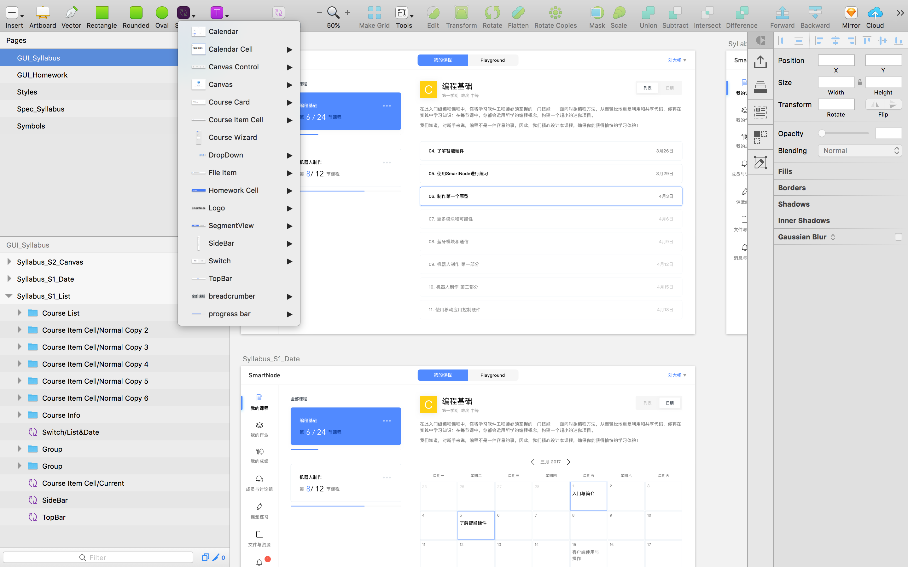
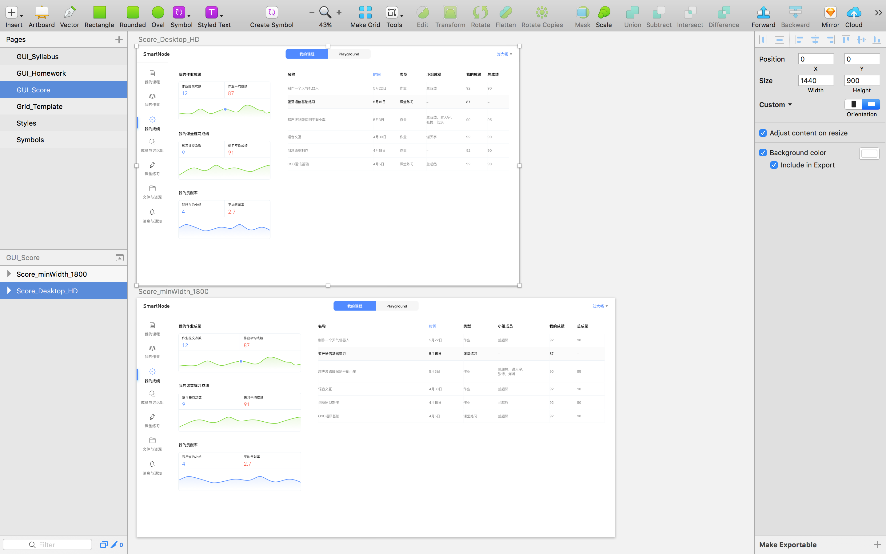
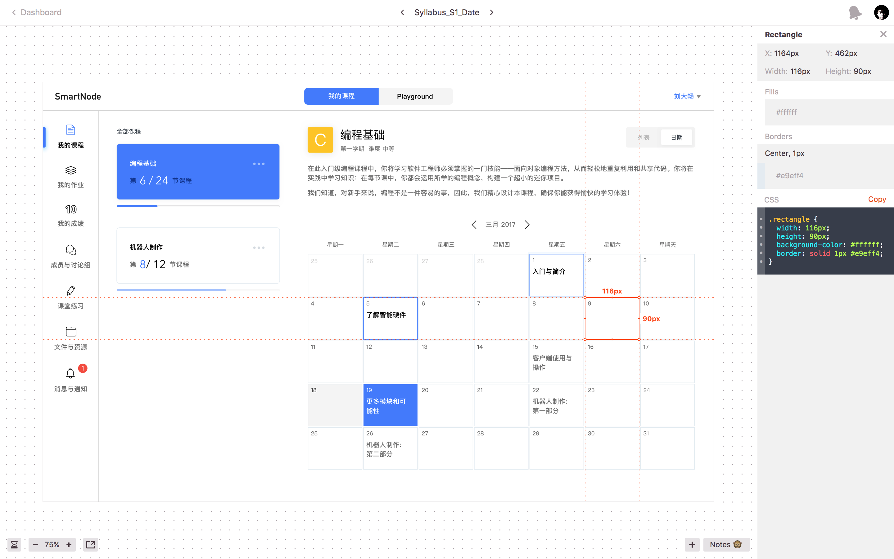

# SmartNode
Project SmartNode, CPR Center for Digital Innovation

## General

We use Sketch + Invision + Zeplin + Framer to manage design assets.

## Design Assets

#### Sketch (Source)
<a href="https://sketch.cloud/s/gkbd" target="_blank">Wireframes</a>

<a href="https://sketch.cloud/s/zAZe/p/gui_syllabus" target="_blank">GUI</a>

Please check (nested) symbols as needed when implementing UI components.

The newly redesigned resizing controls in Sketch 44 gives us more flexibility when designing responsive layouts. We design a general responsive grid template based on this specific feature. Now you can resize the artboard to change the layout correspondingly. (The default demension of the artboard is the min width/height within the media query).

#### Invision (Design Sprint & Interaction Flow)

<a href="https://invis.io/6HBLTNZGB" target="_blank">SmartNode Invision</a>

#### Zeplin

<a href="https://zpl.io/a6fbt" target="_blank">SmartNode Zeplin</a>

Design specs and components style guide. Custom Style sheets(Less, Sass) Preprocessor as needed.

#### Framer

Design specs for Motion and Transition
